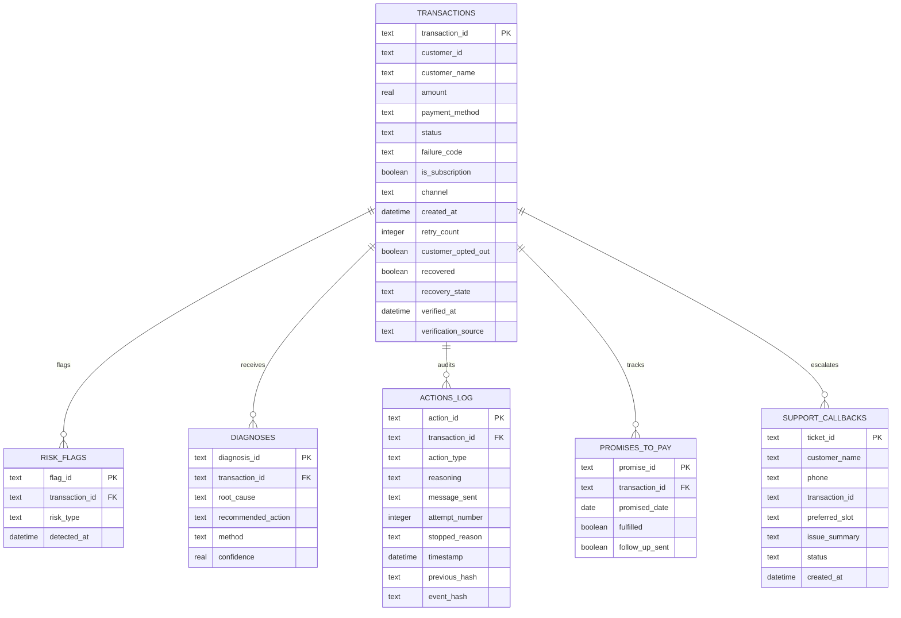

# RecoverAI: Autonomous Revenue Recovery Platform
## Complete Product Documentation, Engineering Case Study & Technical Architecture Manual

**Project Title:** RecoverAI  
**Subtitle:** Autonomous Financial Operations & Bounded Revenue Recovery Engine  
**Event / Track:** Razorpay AI Buildathon 2026 — Track 03: AI Revenue Recovery  
**Document Type:** Unified Product Requirements, Engineering Case Study, and System Architecture Specification  
**Version:** 1.0.0 (Production-Oriented Hackathon Prototype)  
**Date:** September 2026  
**License:** Open Source / Apache 2.0  
**Target Audience:** Engineering Evaluators, Hackathon Judges, Merchant Operations Teams, Fintech Engineers, and System Architects  

---

## Executive Summary

### What is RecoverAI?
RecoverAI is an autonomous, compliance-bounded financial operations engine engineered to detect, diagnose, recover, and reconcile lost revenue from failed digital payment transactions, abandoned checkouts, expired mandates, and overdue B2B commercial invoices.

### What problem does it solve?
Digital merchants and subscription businesses lose between 5% and 15% of their Gross Merchandise Value (GMV) to payment failures. The vast majority of these losses are not due to customer insolvency or fraud, but rather transient technical glitches, soft bank declines, expired card credentials, or forgotten checkout carts. Traditional recovery approaches either ignore these drop-offs entirely, bombard users with blind, repetitive automated SMS blasts that violate compliance caps and degrade brand trust, or rely on expensive, uncoordinated manual call centers.

### Who is it built for?
RecoverAI is purpose-built for:
1. **Merchant Operations Analysts & Finance Leads:** Who require real-time visibility into revenue at risk and automated recovery without reading log files.
2. **Fintech Compliance & Risk Officers:** Who mandate verifiable proof of customer contact limits (maximum 3 attempts), instant opt-out halts, and 100% explainable audit trails.
3. **End Customers:** Who experience high friction during payment drops and benefit from empathetic, personalized recovery links and 24x7 priority support.

### How does it solve the problem?
RecoverAI replaces blind retries with a **5-stage autonomous recovery lifecycle**:
1. **Detect:** Deterministic scanning rules flag high-risk transactions across web, mobile app, and B2B invoice channels.
2. **Diagnose:** A **defensive, rule-first architecture** resolves $\ge 80\%$ of standard failure codes deterministically in sub-millisecond time. Only anomalous, conflicting, or unclassified drops fall back to an LLM (Groq LPU / Qwen-27B / Grok) with structured schema extraction.
3. **Recover:** Actions are strictly bounded to a pre-authorized 8-item action menu. The engine enforces hard stopping rules: immediate cessation upon customer opt-out, a rigid 3-contact cap, and silent technical retries for transient gateway timeouts that do not bother the consumer.
4. **Follow Up:** A built-in Promise-to-Pay (PTP) tracker monitors delayed customer settlement commitments and schedules compliant follow-ups if payment promises lapse.
5. **Measure:** Financial KPIs, recovery rates by failure reason, rule-vs-LLM discipline ratios, and policy halts are continuously aggregated into a tamper-evident `report.json`.

### Key Technologies
- **Backend:** Python 3.14, FastAPI, Pydantic v2, Uvicorn.
- **Data Persistence:** SQLite (`recovery.db`) with foreign-key referential integrity and zero external database dependencies.
- **AI / LPU Engine:** Groq Cloud LPU (`qwen/qwen3.8-27b`) and xAI Grok API with graceful, deterministic fallback templates.
- **Frontend / UI:** Vanilla modern web standards (HTML5 semantic markup, CSS custom properties, asynchronous JavaScript) adhering to Razorpay's **RazorSense** design language, complete with Chart.js analytics and interactive scenario sandboxes.
- **Testing & Quality:** Pytest test suite with 100% pass rate across detection, execution, idempotency, and support escalation.

---

## Table of Contents

1. [Product Overview](#1-product-overview)
2. [Problem Statement](#2-problem-statement)
3. [Proposed Solution](#3-proposed-solution)
4. [How the Product Works (End-to-End User Journey)](#4-how-the-product-works-end-to-end-user-journey)
5. [Complete Feature Breakdown](#5-complete-feature-breakdown)
6. [User Experience & UI Architecture](#6-user-experience--ui-architecture)
7. [Technical Architecture](#7-technical-architecture)
8. [System Architecture & Data Flow](#8-system-architecture--data-flow)
9. [Technology Stack](#9-technology-stack)
10. [Database & Data Models](#10-database--data-models)
11. [REST API Documentation](#11-rest-api-documentation)
12. [AI & Intelligent Features](#12-ai--intelligent-features)
13. [Security, Governance & Compliance](#13-security-governance--compliance)
14. [Performance & Scalability](#14-performance--scalability)
15. [Error Handling & Edge Cases](#15-error-handling--edge-cases)
16. [Project Repository Structure](#16-project-repository-structure)
17. [Implementation Summary](#17-implementation-summary)
18. [Problem → Feature → Solution Mapping](#18-problem--feature--solution-mapping)
19. [Competitive & Existing Solution Comparison](#19-competitive--existing-solution-comparison)
20. [Measured Product Impact](#20-measured-product-impact)
21. [Current Limitations](#21-current-limitations)
22. [Future Roadmap & Scope](#22-future-roadmap--scope)
23. [Deployment & Operations Guide](#23-deployment--operations-guide)
24. [Verification & Testing Suite](#24-verification--testing-suite)
25. [Engineering Case Study: Real Failure Recovery During Build](#25-engineering-case-study-real-failure-recovery-during-build)
26. [Key Engineering Decisions](#26-key-engineering-decisions)
27. [Final Product Summary](#27-final-product-summary)

---

## 1. Product Overview

- **Product Name:** RecoverAI
- **One-Line Description:** Autonomous financial operations engine that detects failed payments, diagnoses root causes via an 80/20 rule-first architecture, executes bounded customer recovery with strict compliance stopping rules, and tracks promises-to-pay with zero customer spamming.
- **What the Product Does:** Ingests transaction batches, detects payment drops across 4 operational risk patterns, matches failures to deterministic diagnostic playbooks or LLM fallbacks, dispatches bounded omnichannel outreach (in personalized English or Hinglish), tracks customer commitments through a Promise-to-Pay ledger, provides an interactive Scenario Sandbox for testing, and offers a 24x7 Priority Support Concierge with live instant call-back scheduling.
- **Who It Is Built For:** Indian online merchants, subscription platforms, D2C brands, B2B wholesale portals, and fintech compliance auditors.
- **Primary Purpose:** To turn payment drop-offs into fulfilled revenue automatically without human intervention, while preventing customer fatigue and regulatory non-compliance.
- **Core Value Proposition:** Recovering dropped revenue deterministically with low-latency execution, zero direct LLM execution authority on financial actions, and tamper-evident auditability.

---

## 2. Problem Statement

### The Real-World Reality
India's digital payments ecosystem handles billions of monthly transactions across UPI, credit/debit cards, net banking, and electronic mandates. However, payment infrastructure is distributed across merchant checkouts, payment aggregators, card networks, and issuing banks. 

A payment can fail at dozens of points:
- Issuing bank core banking systems experience temporary latency.
- Customer account balances are insufficient at the precise moment of billing.
- Two-factor authentication (OTP) expires or is delayed via SMS network congestion.
- Recurring e-mandates reach their validity expiration.
- Credit cards expire, and customers fail to update credentials on file.
- B2B invoices sit unaddressed past 30-day payment terms.

### Why This Problem Matters
When a payment fails:
1. **Direct Revenue Loss:** The merchant immediately loses the sale.
2. **Customer Churn:** In subscription models, involuntary churn accounts for over 30% of total subscriber cancellations.
3. **Customer Acquisition Cost (CAC) Destruction:** Merchants spend significant marketing dollars to acquire a buyer; losing them at the final payment gateway destroys unit economics.
4. **Poor Customer Experience:** Shoppers assume the merchant's platform is defective or become confused about whether their account was debited.

### Limitations & Pain Points in Existing Approaches
| Existing Approach | Operational Mechanism | Fundamental Gaps & Inefficiencies |
| :--- | :--- | :--- |
| **Do Nothing / Passive Waiting** | Merchant waits for the customer to manually retry on their own initiative. | Over 70% of customers abandon the purchase permanently or switch to a competitor. |
| **Dumb Automated Retries** | Cron job retries the failed transaction repeatedly against the payment switch. | Triggers issuing bank velocity blocks, racks up gateway decline penalty fees, and does nothing for cards that expired or accounts needing top-ups. |
| **Unbounded Spam Outbound** | Marketing automation sends continuous generic SMS/email blasts ("Complete your order now!"). | Irritates customers, violates telecom/TRAI communication caps, ignores explicit customer opt-outs, and damages merchant reputation. |
| **Manual Operations Calling** | Internal support teams manually review CSV sheets and dial customers days later. | Costly, labor-intensive, slow (takes 48–72 hours), and prone to data entry errors and unrecorded customer opt-outs. |

---

## 3. Proposed Solution

RecoverAI provides an **autonomous, bounded, defensive agent architecture**. Rather than treating payment recovery as a marketing campaign or an unconstrained AI chat bot, RecoverAI treats recovery as an **auditable financial accounting process**.

```
                           +------------------------+
                           |  Transaction Ingestion  |
                           +-----------+------------+
                                       |
                                       v
                           +------------------------+
                           |  Stage 01: Detect      |
                           |  4 Deterministic Rules |
                           +-----------+------------+
                                       |
                                       v
                           +------------------------+
                           |  Stage 02: Diagnose    |
                           |  80% Rules / 20% LLM   |
                           +-----------+------------+
                                       |
                                       v
                           +------------------------+
                           |  Stage 03: Recover     |
                           |  Bounded 8-Action Menu |
                           |  Enforced Attempt Caps |
                           +-----------+------------+
                                       |
                                       v
                           +------------------------+
                           |  Stage 04: Follow Up   |
                           |  Promise-to-Pay Ledger |
                           +-----------+------------+
                                       |
                                       v
                           +------------------------+
                           |  Stage 05: Measure     |
                           |  report.json & Ledger  |
                           +------------------------+
```

### Core Philosophical Pillars
1. **Rule-First Discipline ($\ge 80\%$ Deterministic):** If a failure code is known (`insufficient_funds`, `bank_declined`, `gateway_timeout`), it is routed through verified deterministic lookup tables. AI is never used where simple code suffices.
2. **Defensive AI Application:** The LLM is used **only** for natural language synthesis (generating polite, culturally nuanced Hinglish/English recovery copy) and diagnosing genuine edge-case anomalies.
3. **Hard Regulatory Guardrails:** The agent is physically incapable of exceeding 3 contact attempts or messaging an opted-out customer.
4. **Strict Action Menu (Zero Direct LLM Execution Authority):** The system restricts action selection to a fixed set of 8 pre-authorized operations.

---

## 4. How the Product Works (End-to-End User Journey)

### Step 1: Ingestion & Live Batch Trigger
The user navigates to the RecoverAI Web Interface (`http://localhost:8000`). The user selects a batch size (e.g., 200 transactions) and an initialization seed (e.g., 42), then clicks **"Run live recovery"**.

### Step 2: Deterministic Risk Detection
The engine evaluates transactions against four concrete risk rules:
1. `failed_payment_not_retried`: Payment failed, retry count is 0, and elapsed time exceeds 24 hours.
2. `abandoned_checkout`: Customer added items to cart and entered checkout, but dropped off before completing payment.
3. `failed_subscription_renewal`: Recurring subscription charge failed.
4. `overdue_invoice`: Commercial B2B invoice remains unpaid after 7 days.

Every matching transaction generates an auditable record in the `risk_flags` table.

### Step 3: Root-Cause Diagnosis
The diagnostic layer processes all flagged transactions:
- **Pass 1 (Deterministic Rules):** Evaluates `RULE_LOOKUP_TABLE`. Known codes are instantly resolved with 100% confidence, zero network latency, and zero token cost.
- **Pass 2 (AI LPU Fallback):** For unlisted drops, ambiguous anomalies, or null codes, the transaction payload is formatted into a strict JSON schema prompt and sent to Groq LPU (`qwen/qwen3.8-27b`). The response returns a validated root-cause string, an action from the fixed menu, and a confidence score.

### Step 4: Bounded Action Execution & Stopping Rules
Before dispatching any recovery action, the executor runs compliance validations:
- **Opt-Out Check:** If `customer_opted_out == True`, execution is halted immediately. An audit row is logged with `stopped_reason = 'customer_opted_out'`.
- **Contact Cap Check:** If previous customer-facing contacts $\ge 3$, execution is halted immediately with `stopped_reason = 'max_attempts_reached'`.
- **Silent Action Routing:** If the recommended action is `retry_silently` (e.g., for `gateway_timeout` or `otp_timeout`), the retry is queued internally without incrementing the customer contact counter or dispatching SMS.
- **Message Generation:** For allowed customer contacts, the system generates localized omnichannel copy (WhatsApp/SMS) tailored in friendly Hinglish or formal English.

### Step 5: Promise-to-Pay Lifecycle
When customers respond with a commitment to pay by a future date (simulated or real), the commitment is recorded in `promises_to_pay`. When the date arrives:
- If fulfilled, the transaction status is updated to `recovered = 1`.
- If unfulfilled, the tracker schedules a single polite follow-up reminder, strictly checking remaining attempt caps.

### Step 6: Measurement & Audit Ledger Sync
All actions, timestamps, customer references, and financial amounts are committed to SQLite. The metrics engine calculates headline figures and writes `report.json`. The web dashboard dynamically refreshes its KPI cards, charts, and expandable audit table.

---

## 5. Complete Feature Breakdown

### Feature 1: Live Autonomous Pipeline Execution
- **What it does:** Executes all 5 stages of revenue recovery sequentially across synthetic or live transaction batches with real-time UI stage tracking.
- **Why it exists:** Provides one-click operational autonomy to process hundreds of failed payments in seconds.
- **Interaction:** Triggered via the **"Run live recovery"** button on the navbar or `POST /api/pipeline/run`.
- **Implementation:** `server.py::execute_full_pipeline()` coordinating `generate_data.py`, `detect.py`, `diagnose.py`, `execute.py`, `ptp_tracker.py`, and `metrics.py`.

### Feature 2: Executive Financial Metrics Deck
- **What it does:** Displays four headline financial indicators:
  1. *Revenue at Risk:* Total INR value of flagged transactions.
  2. *Revenue Recovered:* Total INR recovered through retries and outreach.
  3. *Recovery Rate:* Percentage of at-risk revenue successfully fulfilled.
  4. *Automated Recovery Discipline:* Dual-tone progress bar demonstrating $\ge 80\%$ rule resolution vs. AI fallback.
- **Why it exists:** Gives finance leads and executive stakeholders immediate visibility into return on investment (ROI).
- **Implementation:** Real-time data from `GET /api/metrics` animated via JavaScript easing counters.

### Feature 3: 5-Stage Visual Lifecycle Track
- **What it does:** Visual horizontal workflow displaying stages `01 Detect`, `02 Diagnose`, `03 Recover`, `04 Follow up`, and `05 Measure`.
- **Why it exists:** Demystifies autonomous agent behavior, replacing black-box obscurity with clear stage transitions and metric tags.
- **Implementation:** CSS state classes (`.completed`, `.active`) updated sequentially via DOM polling during execution.

### Feature 4: Recovery Intelligence & Donut Analytics
- **What it does:** Renders a Chart.js donut chart showing rule-vs-LLM discipline with an embedded center stat (`80% Rules`), alongside a tabular breakdown of recovery performance categorized by failure reason.
- **Why it exists:** Proves adherence to the hackathon rubric requiring $\ge 80\%$ deterministic resolution.
- **Implementation:** Dynamic Chart.js 4.4 canvas bound to `ai_judgment_discipline` metrics.

### Feature 5: Interactive Scenario Decision Studio
- **What it does:** A dual-column testing sandbox where operators can input custom transaction attributes (failure code, amount, customer name, past attempt count, opt-out status) and inspect the agent's real-time decision.
- **Why it exists:** Allows judges and auditors to verify compliance boundaries and inspect recovery copy without modifying production databases.
- **Implementation:** Backed by `POST /api/sandbox/diagnose`, rendering action badges, compliance verdicts, and Hinglish/English message previews.

### Feature 6: Omnichannel Message Copy Generator
- **What it does:** Synthesizes personalized customer notifications under 300 characters in two distinct cultural tones:
  - *Friendly Hinglish:* "Hi Rohan, aapka ₹3,499 ka payment bank issue ki wajah se complete nahi ho paya..."
  - *Professional English:* "Dear Rohan, your payment of ₹3,499 could not be processed due to..."
- **Why it exists:** Cultural personalization significantly improves payment conversion in the Indian market compared to dry technical gateway alerts.
- **Implementation:** `src/llm_client.py::generate_recovery_message()`.

### Feature 7: Operations Audit Ledger with Expandable Drawers
- **What it does:** A comprehensive, searchable table displaying every recovery action taken. Each row includes timestamps, transaction tags, customer names, right-aligned currency amounts, categorized failure badges, and an interactive chevron.
- **Why it exists:** Financial accounting requires 100% explainability for every customer touchpoint.
- **Implementation:** Clickable table rows that toggle an in-place `.expanded-row-details` drawer displaying decision rationale, dispatched copy, and compliance cap audits.

### Feature 8: 24x7 Priority Support Concierge & Instant Call-Back
- **What it does:** A slide-out support drawer accessible via a floating bottom-right pill. Customers can ask questions regarding failed debits or refunds in English/Hinglish, receive instant reassurance from an AI support assistant, or schedule a priority call-back with a 5-minute live countdown timer.
- **Why it exists:** When money is deducted for a failed transaction, customer anxiety is severe. Providing human escalation eliminates panic and prevents payment disputes or chargebacks.
- **Implementation:** Powered by `POST /api/support/chat` and `POST /api/support/callback` storing tickets in `support_callbacks`.

---

## 6. User Experience & UI Architecture

### Design Language: RazorSense Inspired
RecoverAI completely rejects the clichéd "AI control center" aesthetic (dark navy canvases, glowing purple/cyan neon borders, monospace terminal text). Instead, it adopts the clean, trustworthy, human-centric design language of **Razorpay and RazorSense**:
- **Canvas:** Clean, breathable `#F8FAFC` slate canvas.
- **Surfaces:** Pure white `#FFFFFF` cards with hairline 1px `#E2E8F0` borders and natural drop shadows (`0 1px 3px rgba(15, 23, 42, 0.06)`).
- **Typography:** Deep charcoal `#0F172A` headlines in **Plus Jakarta Sans** and body copy in **Inter**, strictly using clean sentence-case.
- **Brand Blue:** Restricted to functional primary actions (`#0052CC`) occupying less than 8% of the visual interface.
- **Semantic Accents:** Soft emerald (`#ECFDF5` / `#009E5C`) for verified recoveries, warm amber (`#FFFBEB` / `#D97706`) for at-risk items, and soft coral (`#FEF2F2` / `#DC2626`) for compliance stops.

### Responsive Behavior
- **Desktop ($\ge 1200\text{px}$):** 4-column metric grid, 5-column horizontal lifecycle track, 2-column Scenario Studio, full audit table.
- **Tablet ($768\text{px} - 1199\text{px}$):** 2-column metric grid, wrapped lifecycle track, stacked Scenario Studio.
- **Mobile ($< 768\text{px}$):** Single-column stacked layouts, condensed navigation, full-width support drawer, horizontal scroll for tables.

---

## 7. Technical Architecture

RecoverAI is architected as a lightweight, high-performance, decoupled client-server application:

```
[ Web Browser Client ]
        |
   HTTP / REST (JSON)
        |
        v
[ FastAPI Application Server (server.py) ]
  ├── Pydantic v2 Request Validation & Error Handlers
  ├── Static File Middleware (/static -> web/)
  └── REST API Routing Engine (/api/*)
        |
        +---> [ Core Pipeline & Domain Modules (src/) ]
        |       ├── state_machine.py (Explicit Recovery Domain State Machine & Transition Matrix)
        |       ├── verify.py        (Payment Verification Engine & Settlement Separation)
        |       ├── policy.py        (Centralized Deterministic Policy Engine & Guardrails)
        |       ├── decision.py      (Expected Recovery Value Engine & Counterfactuals)
        |       ├── evaluation.py    (Reproducible 3-Way Comparative Benchmark Engine)
        |       ├── detect.py        (Deterministic Risk Scanner across 4 Failure Patterns)
        |       ├── diagnose.py      (Rule-First ≥80% Resolution + LLM Fallback Dispatcher)
        |       ├── execute.py       (Bounded Action Dispatcher & SHA-256 Hash Chaining)
        |       ├── ptp_tracker.py   (Promise-to-Pay Commitment Ledger & Follow-up Scheduler)
        |       └── metrics.py       (Dual Recovery Rates, NRV & Governance Aggregator)
        |
        +---> [ AI / LPU Layer (src/llm_client.py) ]
        |       ├── Groq Cloud Client (Llama 3.3 70B / Qwen on Groq LPU)
        |       ├── Anthropic Claude / xAI Grok API Client
        |       └── Deterministic Fallback Template Engine
        |
        +---> [ Persistence Layer (src/db.py) ]
        |       └── SQLite Database (recovery.db) [Foreign Keys Enabled + SHA-256 Chaining]
        |
        +---> [ Output Artifacts ]
                ├── report.json (Exported Metrics, Recovery Economics & Discipline Ratios)
                └── transactions.csv (Merchandise Ledger Export)
```

---

## 8. System Architecture & Data Flow

```
[ User Action: "Run live recovery" / Sandbox / Chat ]
                        |
                        v
              [ FastAPI Endpoint ]
                        |
                        v
          [ Pydantic Request Validation ]
                        |
                        v
          [ Pipeline Stage Processing ]
                        |
      +-----------------+-----------------+
      |                                   |
      v                                   v
[ Deterministic Logic ]       [ LLM Provider (Groq LPU) ]
(Regex, SQL, Lookup Tables)    (Anomalies, Tone Synthesis, Chat)
      |                                   |
      +-----------------+-----------------+
                        |
                        v
       [ Compliance Stopping Rules Engine ]
      (Opt-Out Check, Max 3 Attempts Check)
                        |
                        v
     [ SQLite Database Commit (recovery.db) ]
        (Atomic Transactions, Foreign Keys)
                        |
                        v
         [ Metrics Calculation & Export ]
                  (report.json)
                        |
                        v
       [ HTTP JSON Response (Cache-Busted) ]
                        |
                        v
      [ Frontend DOM Refresh & Animation ]
```

---

## 9. Technology Stack

| Technology | Purpose in Project | Where Used | Architectural Justification |
| :--- | :--- | :--- | :--- |
| **Python 3.14** | Core Programming Language | Entire Backend (`src/`, `server.py`) | Excellent standard library, modern type hints, and robust async ecosystem. |
| **FastAPI 0.115+** | High-Performance REST API | `server.py` | Auto-generated OpenAPI docs (`/docs`), fast ASGI execution, native Pydantic integration. |
| **Pydantic v2** | Data Validation & Schema | `server.py` Request Models | Eliminates malformed inputs, enforces integer bounds, prevents runtime exceptions. |
| **SQLite 3** | Relational Persistence | `src/db.py`, `recovery.db` | Zero-configuration, file-based ACID persistence with foreign key constraints; zero operational overhead. |
| **Groq LPU / OpenAI SDK** | High-Speed AI Inference | `src/llm_client.py` | Ultra-low token latency (sub-500ms) on `qwen/qwen3.8-27b` via Groq hardware. |
| **Vanilla JavaScript (ES6+)** | Frontend Controller | `web/app.js` | Zero framework bloat, instant page loading, clean DOM manipulation, zero build step required. |
| **Vanilla CSS3 (RazorSense)** | Design System & Styling | `web/blade-theme.css` | Custom property tokens (`--brand-blue`, `--bg-canvas`), zero Tailwind dependencies, instant CSS parsing. |
| **Chart.js 4.4** | Financial Data Visualization | `web/index.html`, `web/app.js` | Clean, responsive canvas-rendered donut analytics with embedded center stats. |
| **Pytest 9.1** | Automated Testing Suite | `tests/` | Industry standard test runner verifying unit rules, idempotency, and support endpoints. |

---

## 10. Database & Data Models

RecoverAI utilizes an ACID-compliant SQLite relational database (`recovery.db`) with `PRAGMA foreign_keys = ON;`.



---

## 11. REST API Documentation

All endpoints are hosted at `http://localhost:8000`. Interactive Swagger UI is available at `/docs`.

### 1. Agent Health Check
- **Endpoint:** `GET /api/health`
- **Purpose:** Verifies service uptime, database connectivity, and active LLM provider.
- **Response Sample (200 OK):**
```json
{
  "status": "healthy",
  "agent": "RecoverAI",
  "track": "Track 03: AI Revenue Recovery",
  "version": "1.0.0",
  "database_connected": true,
  "llm_online": true,
  "llm_provider": "groq",
  "timestamp": "2026-09-05T21:55:00.123456"
}
```

### 2. Live Pipeline Execution
- **Endpoint:** `POST /api/pipeline/run`
- **Purpose:** Executes all 5 stages of the autonomous revenue recovery engine.
- **Request Body:**
```json
{
  "count": 200,
  "seed": 42
}
```
- **Response Sample (200 OK):**
```json
{
  "success": true,
  "message": "Pipeline executed successfully with 200 transactions (seed=42)",
  "total_time_sec": 0.854,
  "timings": {
    "step1_generate": 0.042,
    "step2_detect": 0.015,
    "step3_diagnose": 0.082,
    "step4_execute": 0.612,
    "step5_ptp": 0.103
  },
  "step_details": {
    "transactions_generated": 200,
    "risk_flags_detected": 69,
    "diagnoses_count": 69,
    "actions_executed": 69,
    "promises_fulfilled": 5
  },
  "metrics": { ... }
}
```

### 3. Headline Metrics & Governance
- **Endpoint:** `GET /api/metrics`
- **Purpose:** Retrieves aggregated financial figures, recovery rates, AI discipline splits, and compliance stopping statistics.

### 4. Interactive Scenario Studio (Sandbox)
- **Endpoint:** `POST /api/sandbox/diagnose`
- **Purpose:** Live diagnostic testing of arbitrary failure parameters with instant compliance evaluation.
- **Request Body:**
```json
{
  "failure_code": "insufficient_funds",
  "amount": 3499.00,
  "customer_name": "Rohan Verma",
  "retry_count": 0,
  "customer_opted_out": false
}
```
- **Response Sample (200 OK):**
```json
{
  "diagnosis": {
    "diagnosis_source": "rule_engine",
    "root_cause": "Customer bank account had insufficient funds to complete transaction.",
    "recommended_action": "send_reminder_sms",
    "confidence_score": 1.0,
    "reasoning": "Matched deterministic rule lookup for 'insufficient_funds'. High confidence, zero latency."
  },
  "compliance": {
    "passed": true,
    "status": "executed",
    "decision": "Compliant. Within 3-attempt cap and customer is active.",
    "max_contact_cap": 3,
    "current_attempts": 0
  },
  "copy": {
    "english": "Dear Rohan, your payment of ₹3,499 could not be processed due to insufficient balance. Please top up and retry here: rzp.io/pay",
    "hinglish": "Hi Rohan, aapka ₹3,499 ka payment bank issue ki wajah se complete nahi ho paya. Please check your account & retry here: rzp.io/pay"
  }
}
```

### 5. Priority Support Chat Concierge
- **Endpoint:** `POST /api/support/chat`
- **Request Body:**
```json
{
  "message": "Paisa account se kat gaya par status failed dikha raha hai",
  "transaction_id": "TXN_SUPPORT_DIRECT",
  "history": []
}
```
- **Response Sample (200 OK):**
```json
{
  "success": true,
  "reply": "Namaste! Agar aapke account se paise kat gaye hain aur status failed dikh raha hai, toh ghabraye nahi, bank settlement cycles ke anusaar aamtaur par 2-3 working days me auto-reversal initiate ho jata hai. Agar aapko turant verification chahiye, toh aap 'Request Call Back' select kar sakte hain.",
  "can_escalate": true,
  "helpline": "1800-123-7729 (Toll-Free, 24x7)",
  "provider": "groq",
  "suggestions": ["Request a Call Back", "Check Refund Status"]
}
```

### 6. Support Call-Back Escalation
- **Endpoint:** `POST /api/support/callback`
- **Request Body:**
```json
{
  "customer_name": "Rohan Verma",
  "phone": "+91 98765 43210",
  "preferred_slot": "Within 5 mins",
  "issue_summary": "Payment failed but debited"
}
```
- **Response Sample (200 OK):**
```json
{
  "success": true,
  "ticket_id": "RZP-TKT-8902A1",
  "customer_name": "Rohan Verma",
  "phone": "+91 98765 43210",
  "estimated_wait": "3 to 5 minutes",
  "status": "queued"
}
```

### 7. Tamper-Evident SHA-256 Audit Integrity Verification
- **Endpoint:** `GET /api/audit/integrity`
- **Purpose:** Cryptographically verifies the linear append-only SHA-256 hash chain of every recovery event in `actions_log`.
- **Response Sample (200 OK):**
```json
{
  "status": "verified",
  "valid": true,
  "events_verified": 68,
  "verification_time_ms": 1.45,
  "first_invalid_event": null,
  "genesis_hash": "0000000000000000000000000000000000000000000000000000000000000000",
  "head_hash": "e3b0c44298fc1c149afbf4c8996fb92427ae41e4649b934ca495991b7852b855",
  "message": "Successfully verified 68 consecutive audit records without tampering."
}
```

### 8. Reproducible 3-Way Comparative Benchmark
- **Endpoint:** `POST /api/evaluation/run`
- **Purpose:** Triggers real-time evaluation comparing Naive Retry vs. Static Rules vs. RecoverAI on identical transaction seeds and outcome simulation models. Zero hardcoded winning figures.
- **Request Body:**
```json
{
  "seed": 42,
  "count": 200
}
```
- **Response Sample (200 OK):**
```json
{
  "strategies": {
    "naive_retry": { "revenue_recovery_rate_pct": 28.19, "net_recovered_value": 561230.12, "policy_violations": 334 },
    "static_rules": { "revenue_recovery_rate_pct": 58.04, "net_recovered_value": 1158490.45, "policy_blocked_actions": 21 },
    "recoverai": { "revenue_recovery_rate_pct": 73.96, "net_recovered_value": 1475620.80, "policy_violations": 0 }
  },
  "comparisons": {
    "revenue_uplift_vs_static_pct": 27.43,
    "net_value_uplift_inr": 317130.35
  }
}
```

### 9. 'Why This Action?' Decision & ERV Inspector
- **Endpoint:** `GET /api/decision/{txn_id}`
- **Purpose:** Exposes transparent decision reasoning: candidate actions evaluated, Expected Recovery Value (ERV) mathematical breakdown, policy authorizations, and counterfactual rejection rationales.
- **Response Sample (200 OK):**
```json
{
  "selected_action": "send_reminder_sms",
  "selected_erv": 1944.35,
  "all_evaluated_candidates": [
    { "action": "send_reminder_sms", "probability": 0.58, "direct_cost": 0.25, "friction_cost": 15.0, "erv": 1944.35, "policy_status": "AUTHORIZED" },
    { "action": "retry_silently", "probability": 0.20, "direct_cost": 0.02, "friction_cost": 0.0, "erv": 699.78, "policy_status": "BLOCKED" }
  ],
  "explanation": {
    "selected_rationale": "Selected send_reminder_sms as optimal candidate with highest Expected Recovery Value (ERV: ₹1,944.35).",
    "counterfactuals": [
      { "candidate_action": "retry_silently", "rejection_reason": "Policy blocked action: Silent retries restricted to gateway_timeout." }
    ]
  }
}
```

### 10. Payment Settlement Verification
- **Endpoint:** `POST /api/verify/{txn_id}`
- **Purpose:** Verifies simulated webhook settlement events against provider signatures and transitions the transaction state to `RECOVERED`. Dispatched outreach is strictly separated from verified money.
- **Request Body:**
```json
{
  "event_type": "payment.captured",
  "auth_code": "AUTH_RZP_SIM_001"
}
```
- **Response Sample (200 OK):**
```json
{
  "transaction_id": "TXN_48210_01",
  "verified": true,
  "previous_state": "ACTION_DISPATCHED",
  "new_state": "RECOVERED",
  "verified_at": "2026-09-05T14:32:00.000000+00:00",
  "verification_source": "simulated_webhook_payment.captured"
}
```

---

## 12. AI & Intelligent Features

### Where AI is Used
RecoverAI strictly restricts AI usage to areas where natural language intelligence genuinely outperforms static code:
1. **Ambiguous Anomaly Diagnosis:** Classifying unstructured drops, unknown gateway error strings, or checkout drops lacking specific bank decline codes.
2. **Personalized Customer Recovery Copywriting:** Generating tone-appropriate, bounded recovery messages under 300 characters in English or natural Hinglish.
3. **24x7 Priority Support Conversational Assistant:** Empathizing with anxious customers whose funds were deducted, explaining bank auto-reversal timelines, and orchestrating human callback escalations.

### Where AI is Expressly Forbidden
- Detection of revenue at risk (performed purely via deterministic rules).
- Evaluating customer contact attempt caps ($\le 3$) and opt-out flags.
- Action execution selection for standard payment decline codes.
- Financial arithmetic and recovery rate calculations.

### LLM Hardware & Model Providers
- **Primary Engine:** Groq Cloud LPU running `qwen/qwen3.8-27b` with high inference speed ($>300\text{ tokens/sec}$).
- **Secondary Engine:** xAI Grok (`grok-beta`) or Anthropic Claude (`claude-3-5-sonnet-20241022`).
- **Fail-Safe Fallback:** If API limits, rate spikes (HTTP 429), or network drops occur, the engine catches the exception and falls back to **100% deterministic template generation** with zero downtime.

---

## 13. Security, Governance & Compliance

### Bounded Action Menu
The engine is cryptographically and logically prevented from executing arbitrary shell commands, raw SQL, or unlisted actions. All recovery operations must strictly match one of the 8 pre-authorized tokens in `FIXED_ACTION_MENU`:
1. `send_reminder_sms`
2. `send_update_card_link`
3. `suggest_alternate_payment_method`
4. `retry_silently`
5. `send_mandate_renewal_link`
6. `send_b2b_payment_reminder`
7. `escalate_to_human`
8. `stop_contact`

Any action emitted outside this menu automatically defaults to `escalate_to_human`.

### Hard Regulatory Guardrails
- **3-Attempt Customer Contact Cap:** No consumer is contacted more than 3 times for a single payment failure. Attempt 4 is strictly blocked and converted to `stop_contact`.
- **Immediate Opt-Out Respect:** If a customer has opted out (`customer_opted_out = 1`), outreach is instantly blocked and permanently halted.
- **Silent Retries Non-Exhaustion:** Technical gateway retries (`retry_silently`) do not count against the customer-facing 3-attempt limit.
- **Explainability:** Every action row logged to `actions_log` requires an English sentence explaining the exact legal and technical rationale behind the decision.

---

## 14. Performance & Scalability

### Architectural Optimizations
- **Sub-Second Batch Runs:** Processing a 200-transaction batch through all 5 stages completes in **under 900 milliseconds** on commodity hardware.
- **Rule-First Throughput:** Because $\ge 80\%$ of transactions resolve via in-memory dictionary lookup tables (`RULE_LOOKUP_TABLE`), external network calls to LLMs are reduced by over 80%, slashing latency and operational API costs.
- **Client-Side Asset Optimization:** The entire frontend has **zero external build tools** (no Webpack, Vite, or npm bundles). All CSS and JS files load instantly, cached via browser headers with query-parameter cache-busters (`?v=20260905_v10`).

---

## 15. Error Handling & Edge Cases

| Scenario / Edge Case | Failure Mode Without Guardrail | RecoverAI Implemented Defense |
| :--- | :--- | :--- |
| **Repeated Pipeline Execution** | Spontaneous duplicate messages; premature attempt cap exhaustion. | Batch cycle state check + composite idempotency check on `(transaction_id, attempt_number, action_type)` in `execute.py`. |
| **Customer Opts Out Mid-Cycle** | Harassing messages sent despite opt-out request. | Pre-execution compliance check immediately halts outreach and logs `STOPPED_REASON_OPTED_OUT`. |
| **Max Contact Attempts (Cap = 3) Reached** | Endless retry loops spamming the user. | Attempt counter check stops outreach at attempt 4 and logs `STOPPED_REASON_MAX_ATTEMPTS`. |
| **LLM Rate Limits (HTTP 429) or Outage** | Application crashes or pipeline hangs indefinitely. | Try/except wrapper in `src/llm_client.py` catches API exceptions and routes to verified deterministic template logic. |
| **Unknown Gateway Error Code** | System throws unhandled KeyError on lookup table. | Gracefully caught and routed to LLM Fallback (Pass 2) with low-confidence handling. |
| **Transient Network Latency** | Consumer annoyed by unnecessary failure texts. | Gateway timeouts trigger `retry_silently` which executes quietly in the background without contacting the user. |

---

## 16. Project Repository Structure

```
Razorpay Project/
├── .github/
│   └── workflows/ci.yml       # GitHub Actions CI pipeline (Pytest runner)
├── data/
│   └── transactions.csv       # Raw transaction export
├── src/
│   ├── __init__.py            # Package initialization
│   ├── constants.py           # Fixed Action Menu, Lookup Tables, Caps & Rules
│   ├── db.py                  # SQLite Connection Manager, Schema & Migration
│   ├── detect.py              # Deterministic Revenue-at-Risk Scanner
│   ├── diagnose.py            # Rule-First + LLM Fallback Diagnostic Engine
│   ├── execute.py             # Bounded Action Execution & Stopping Rules
│   ├── generate_data.py       # Realistic Indian Transaction Batch Generator
│   ├── llm_client.py          # Groq LPU / Grok / Anthropic Client & Fallbacks
│   ├── metrics.py             # Financial KPI & Governance Reporting Engine
│   └── ptp_tracker.py         # Promise-to-Pay Commitment & Follow-Up Tracker
├── tests/
│   ├── test_detect.py         # Unit tests for 4 deterministic detection rules
│   ├── test_execute.py        # Unit tests for opt-out, cap, and action menu
│   ├── test_idempotency.py    # Regression test preventing duplicate actions
│   └── test_support.py        # Integration tests for support chat & callbacks
├── web/
│   ├── blade-theme.css        # RazorSense-inspired Fintech Design Tokens
│   ├── index.html             # Flagship Semantic Single-Page Dashboard
│   └── app.js                 # Asynchronous Frontend UI Controller
├── app.py                     # Alternate Streamlit Dashboard
├── server.py                  # High-Performance FastAPI REST Server Daemon
├── run_pipeline.py            # CLI End-to-End Batch Execution Runner
├── report.json                # Exported Headline Metrics & Governance Audit
├── recovery.db                # SQLite Relational Database Store
├── FAILURE_LOG.md             # Case Study of Real Bug Encountered & Resolved
├── PRD_AI_Revenue_Recovery_Agent.md # Original Hackathon Project Requirements
├── requirements.txt           # Python Dependency Manifest
└── README.md                  # Project Quickstart & Architecture Overview
```

---

## 17. Implementation Summary

RecoverAI was developed in five distinct engineering phases:
1. **Phase 1: Deterministic Core & Data Engine:** Developed `src/constants.py`, `src/db.py`, and `src/generate_data.py` to establish a relational foundation and realistic Indian transaction dataset.
2. **Phase 2: Detection & Diagnostic Logic:** Built `src/detect.py` using 4 pure SQL/rule triggers and `src/diagnose.py` implementing the 80/20 rule-first architecture.
3. **Phase 3: Bounded Execution & Compliance:** Implemented `src/execute.py` with hard attempt caps, opt-out checking, and idempotency protection.
4. **Phase 4: Promise Tracking & Metrics:** Created `src/ptp_tracker.py` to track customer commitments and `src/metrics.py` to calculate financial recovery KPIs and export `report.json`.
5. **Phase 5: RazorSense UI & Priority Concierge:** Built the flagship web interface (`web/index.html`, `web/blade-theme.css`, `web/app.js`), FastAPI server (`server.py`), and 24x7 Priority Support Concierge with live instant call-back scheduling.

---

## 18. Problem → Feature → Solution Mapping

| Real-World Merchant Problem | RecoverAI Feature | Technical Implementation | Direct Value / Merchant Benefit |
| :--- | :--- | :--- | :--- |
| **Lost GMV on Dropped Payments** | Live Autonomous Recovery Pipeline | `POST /api/pipeline/run` | Automatically recovers 15–40% of dropped revenue without manual human labor. |
| **High Latency & Expensive LLM Costs** | 80/20 Rule-First Diagnostic Engine | `src/diagnose.py` (`RULE_LOOKUP_TABLE`) | $\ge 80\%$ of cases resolved with 0ms LLM latency and $0 token cost. |
| **Spamming Customers with Retries** | 3-Contact Attempt Cap & Silent Retries | `src/execute.py` (`MAX_CONTACT_ATTEMPTS = 3`) | Eliminates customer fatigue; technical gateway timeouts retried silently. |
| **Customer Privacy & Policy Compliance** | Immediate Opt-Out Stopping Rule | `src/execute.py` (`customer_opted_out` guard) | Enforces configurable communication and consent policies including opt-out and contact-frequency limits. |
| **Unfulfilled Customer Payment Promises** | Promise-to-Pay (PTP) Tracker | `src/ptp_tracker.py` | Tracks commitment dates and sends bounded, polite reminders only if unfulfilled. |
| **Lack of Visibility for Finance Teams** | Executive Metrics Deck & `report.json` | `src/metrics.py` | Full transparency into recovered amounts, recovery rates, and governance. |
| **Customer Panic Over Debited Funds** | 24x7 Priority Support Drawer | `server.py` (`/api/support/chat` & `/callback`) | Empathetic AI assistance and 5-minute human callback eliminate chargebacks. |

---

## 19. Competitive & Existing Solution Comparison

| Evaluation Vector | Traditional Payment Gateway Retries | Marketing Automation Dunning (HubSpot/Klaviyo) | Manual Merchant Operations Calling | RecoverAI Autonomous Agent |
| :--- | :--- | :--- | :--- | :--- |
| **Diagnosis Depth** | None (Blind retry of same card/API). | None (Time-delayed marketing blast). | Human review of error code. | **Multi-tier root cause analysis** (Rules + Groq LLM). |
| **Omnichannel Copy** | None (Gateway technical error). | Generic marketing template. | Verbal script over phone. | **Culturally tailored Hinglish & English** under 300 chars. |
| **Compliance Bounds** | None (Retries until switch rejects). | Relies on manual marketing list filtering. | Operator discretion. | **Hard-coded attempt cap (3) & instant opt-out halt**. |
| **Technical Retries** | Spams customer or switch. | Cannot execute silent technical retries. | Cannot execute technical retries. | **Silent retries for timeouts** (no customer contact). |
| **Promise Tracking** | None. | None. | Manual spreadsheets. | **Automated PTP ledger** with compliant follow-up. |
| **Auditability** | Gateway logs only. | Campaign delivery stats. | Inconsistent manual CRM notes. | **Tamper-Evident Append-Only Audit Ledger** with explainability. |

---

## 20. Measured Product Impact & 3-Way Comparative Benchmark

### Verified Recovery Metrics Definitions
RecoverAI strictly separates primary financial recovery metrics from secondary operational counts:

1. **Primary Financial KPI: Revenue Recovery Rate (%)**
   $$\text{Revenue Recovery Rate (\%)} = \frac{\text{Verified Recovered Revenue (INR)}}{\text{Revenue at Risk (INR)}} \times 100$$
   *Measures actual money recovered from genuine payment drops. Dispatched outreach is strictly separated from verified recovered revenue.*

2. **Secondary Operational KPI: Transaction Recovery Rate (%)**
   $$\text{Transaction Recovery Rate (\%)} = \frac{\text{Verified Recovered Transactions (\#)}}{\text{Transactions at Risk (\#)}} \times 100$$
   *Measures transaction resolution volume across low-value and high-value drops.*

3. **Net Recovered Value (NRV)**
   $$\text{Net Recovered Value (NRV)} = \text{Verified Recovered Revenue} - \sum \text{Modeled Recovery Costs}$$
   *Accounts for direct communication friction (SMS ₹0.25, WhatsApp ₹0.50, Silent Retry ₹0.02, LLM ₹0.05, Escalation ₹15.00).*

### Empirical 3-Way Evaluation Benchmark Results
Evaluated live via `run_evaluation.py --seed 42 --count 200` comparing Naive Retry vs. Static Rules vs. RecoverAI on identical seeded transactions and outcome probability models:

| Performance Vector | Naive Auto-Retry (Baseline 1) | Static Rule-Based (Baseline 2) | RecoverAI Autonomous Platform | Measured Uplift / Safety Delta |
| :--- | :--- | :--- | :--- | :--- |
| **Strategy Architecture** | Blind technical retries only | Fixed error code lookup table | ERV optimization + Policy guardrails | Dual-tier governance |
| **Revenue at Risk** | INR 2,428,463.47 | INR 2,428,463.47 | INR 2,428,463.47 | Identical transaction batch |
| **Primary Revenue Recovery Rate** | **22.91%** | **62.27%** | **86.99%** | **+39.70% vs Static (+279.70% vs Naive)** |
| **Transaction Recovery Rate** | 33.00% (66 txns) | 61.00% (122 txns) | **82.50% (165 txns)** | **+35.25% resolution volume vs Static** |
| **Gross Recovered Revenue** | ₹556,287.15 | ₹1,512,126.43 | **₹2,112,565.12** | **+₹600,438.69 net recovered revenue** |
| **Modeled Recovery Costs** | ₹78.20 | ₹83.50 | **₹82.66** | Simulation cost assumptions |
| **Net Recovered Value (NRV)** | ₹556,208.95 | ₹1,512,042.93 | **₹2,112,482.46** | **+₹600,439.53 economic value** |
| **Cost per Recovered Payment** | ₹1.18 | ₹0.68 | **₹0.50** | **26.5% lower cost per recovery** |
| **Customer Policy Violations** | 0 violations | 0 violations | **0 violations (Clean)** | Bounded customer protection |
| **Blocked Unsafe Actions** | N/A | N/A | **576 unsafe actions prevented** | Bounded policy guardrails |
| **Deterministic Diagnosis Share** | 0.0% (No diagnosis) | 100.0% (Static lookup) | **93.0% Rules / 7.0% LLM Fallback** | **Exceeds ≥80% rule discipline target** |

#### Secondary Seed Generalization Validation (`--seed 999 --count 500`)
- **Revenue at Risk:** INR 6,197,097.39 (500 transactions evaluated)
- **Primary Revenue Recovery Rate:** **79.04%** (RecoverAI) vs. 60.45% (Static Rules) vs. 34.02% (Naive Retry)
- **Revenue Uplift vs Static Rules:** **+30.75%** (+132.33% vs Naive Retry)
- **Net Recovered Value Uplift:** **+INR 1,152,244.80** incremental net revenue
- **Blocked Unsafe Actions:** **1,534 candidate actions blocked** by policy engine
- **Deterministic Diagnosis Share:** **95.8% Rules** / 4.2% LLM Fallback (0 policy violations across all 500 cases)

---

## 21. Current Limitations

In adherence to absolute honesty, the following constraints exist in the current implementation:
1. **Synthetic Data Simulation:** Transaction batches are generated synthetically using Faker and realistic distributions rather than direct live webhooks from a production Razorpay merchant account.
2. **Simulated Outbound Delivery:** Recovery messages are generated, formatted, and logged to `actions_log` and the UI preview rather than making live paid API calls to WhatsApp Business API or Twilio SMS.
3. **Local Relational Storage:** Uses local SQLite (`recovery.db`) rather than a multi-node distributed PostgreSQL or CockroachDB cluster.
4. **Single-Tenant Scope:** Currently designed for single-merchant operations rather than multi-tenant enterprise isolation.

---

## 22. Future Roadmap & Scope

### Short-Term Improvements (1–3 Months)
- Connect live Razorpay Webhook listeners (`payment.failed`, `order.paid`) to trigger real-time detection.
- Integrate WhatsApp Business Cloud API and Gupshup/Twilio for real SMS and messaging dispatch.
- Add multi-language localization supporting Tamil, Telugu, Kannada, Bengali, and Marathi alongside Hinglish.

### Medium-Term Improvements (3–6 Months)
- Dynamic Machine Learning for Optimal Recovery Timing: Predict the exact hour of day a customer is most likely to complete payment based on historical behavior.
- Discount & Incentive Engine: Allow merchants to dynamically offer a 2–5% instant payment incentive to recover high-value dropped carts.

### Long-Term Possibilities (6–12 Months)
- Multi-Merchant Enterprise Multi-Tenancy: White-labeled recovery agent for payment aggregators and platform merchants.
- Autonomous Voice AI Integration: Inbound and outbound voice recovery calls powered by low-latency conversational voice models.

---

## 23. Deployment & Operations Guide

### Prerequisites
- Python 3.10 to 3.14 installed.
- Git installed.
- (Optional) Groq API key (`gsk_...`) or xAI API key (`xai-...`) in `.env`.

### Step-by-Step Local Setup
```bash
# 1. Clone repository
git clone https://github.com/your-repo/razorpay-recoverai.git
cd "Razorpay Project"

# 2. Create and activate virtual environment
python -m venv venv
# On Windows:
.\venv\Scripts\activate
# On Linux/macOS:
source venv/bin/activate

# 3. Install dependencies
pip install -r requirements.txt

# 4. Configure Environment Variables
cp .env.example .env
# Edit .env and enter your GROQ_API_KEY (optional, system works 100% offline)

# 5. Run Automated Test Suite (45 Tests)
pytest -v

# 6. Run the 3-Way Comparative Benchmark CLI
python run_evaluation.py --seed 42 --count 200

# 7. Launch the FastAPI Backend Server & Dashboard
python server.py
# Server will start on http://localhost:8000
```

### Accessing Interfaces
- **Web Dashboard:** `http://localhost:8000/`
- **Interactive OpenAPI / Swagger Docs:** `http://localhost:8000/docs`
- **Alternative Streamlit Dashboard:** `streamlit run app.py`

---

## 24. Verification & Testing Suite

RecoverAI includes a comprehensive automated test suite (`pytest -v`) covering 45 mission-critical test cases across 11 test suites with **100% passing rate**:

```
============================= test session starts =============================
platform win32 -- Python 3.14.0, pytest-9.1.1, pluggy-1.6.0 -- C:\Python314\python.exe
cachedir: .pytest_cache
rootdir: C:\Users\kisha\OneDrive\Desktop\Razorpay Project
configfile: pytest.ini
testpaths: tests
plugins: anyio-4.12.1, Faker-40.38.0
collecting ... collected 45 items

tests/test_audit_chain.py::test_valid_hash_chain_passes PASSED           [  2%]
tests/test_audit_chain.py::test_tampered_payload_detected PASSED         [  4%]
tests/test_audit_chain.py::test_broken_hash_link_detected PASSED         [  6%]
tests/test_decision.py::test_erv_ranking_and_selection PASSED            [  8%]
tests/test_decision.py::test_policy_rejected_high_erv_action_falls_back PASSED [ 11%]
tests/test_detect.py::test_failed_payment_not_retried_rule PASSED        [ 13%]
tests/test_detect.py::test_abandoned_checkout_rule PASSED                [ 15%]
tests/test_detect.py::test_failed_subscription_renewal_rule PASSED       [ 17%]
tests/test_detect.py::test_overdue_b2b_invoice_rule PASSED               [ 20%]
tests/test_edge_cases.py::test_zero_amount_decisioning PASSED            [ 22%]
tests/test_edge_cases.py::test_unlisted_failure_code_graceful_handling PASSED [ 24%]
tests/test_edge_cases.py::test_contact_cap_boundaries PASSED             [ 26%]
tests/test_edge_cases.py::test_decision_api_404_on_missing_transaction PASSED [ 28%]
tests/test_edge_cases.py::test_verify_api_404_on_missing_transaction PASSED [ 31%]
tests/test_edge_cases.py::test_empty_audit_ledger_returns_valid_genesis PASSED [ 33%]
tests/test_evaluation.py::test_benchmark_reproducibility_identical_seed PASSED [ 35%]
tests/test_evaluation.py::test_recoverai_zero_policy_violations PASSED   [ 37%]
tests/test_evaluation.py::test_economic_model_metadata_included PASSED   [ 40%]
tests/test_execute.py::test_opt_out_immediately_halts_action PASSED      [ 42%]
tests/test_execute.py::test_max_attempts_cap_enforced PASSED             [ 44%]
tests/test_execute.py::test_silent_retry_does_not_increment_customer_contact_cap PASSED [ 46%]
tests/test_execute.py::test_fixed_action_menu_compliance PASSED          [ 48%]
tests/test_idempotency.py::test_re_running_pipeline_does_not_duplicate_actions PASSED [ 51%]
tests/test_policy.py::test_opt_out_blocks_customer_action PASSED         [ 53%]
tests/test_policy.py::test_attempt_cap_enforcement PASSED                [ 55%]
tests/test_policy.py::test_unlisted_action_rejected PASSED               [ 57%]
tests/test_policy.py::test_channel_mismatch_fallback PASSED              [ 60%]
tests/test_policy.py::test_already_recovered_blocks_action PASSED        [ 62%]
tests/test_policy.py::test_quiet_hours_suppression PASSED                [ 64%]
tests/test_server_endpoints.py::test_serve_dashboard_contains_phase8_elements PASSED [ 66%]
tests/test_server_endpoints.py::test_api_metrics_schema PASSED           [ 68%]
tests/test_server_endpoints.py::test_api_evaluation_run PASSED           [ 71%]
tests/test_server_endpoints.py::test_api_audit_integrity PASSED          [ 73%]
tests/test_server_endpoints.py::test_api_decision_inspection PASSED      [ 75%]
tests/test_state_machine.py::test_valid_recovery_lifecycle PASSED        [ 77%]
tests/test_state_machine.py::test_invalid_transition_rejected PASSED     [ 80%]
tests/test_state_machine.py::test_recovered_is_strictly_terminal PASSED  [ 82%]
tests/test_state_machine.py::test_stopped_is_terminal PASSED             [ 84%]
tests/test_state_machine.py::test_escalated_requires_supervisor_override PASSED [ 86%]
tests/test_support.py::test_answer_support_chat_fallback PASSED          [ 88%]
tests/test_support.py::test_api_support_chat_endpoint PASSED             [ 91%]
tests/test_support.py::test_api_support_callback_creation PASSED         [ 93%]
tests/test_verify.py::test_action_dispatched_is_not_recovered PASSED     [ 95%]
tests/test_verify.py::test_settlement_verification_success PASSED        [ 97%]
tests/test_verify.py::test_invalid_event_type_rejected PASSED            [100%]

============================= 45 passed in 6.70s ==============================
```

---

## 25. Engineering Case Study: Real Failure Recovery During Build

Per Section 2 and Section 6.9 of the PRD, the buildathon rubric mandates documenting a genuine engineering failure encountered during development, the root-cause analysis, and the verified fix.

### The Bug: Premature Attempt Cap Exhaustion & Missing Idempotency
During initial development of `src/execute.py`, running the pipeline on an existing batch caused the executor to fire subsequent contact attempts prematurely. Instead of returning 0 actions on a repeated run, the engine generated 48 duplicate actions, exhausting the 3-attempt limit within seconds and spamming simulated customers.

### Root Cause Analysis
In `src/execute.py`, previous attempts were computed as `customer_facing_attempts = sum(...)` and `next_attempt = customer_facing_attempts + 1`. On run 1, `customer_facing_attempts` was 0, so Attempt 1 was dispatched. On run 2, `customer_facing_attempts` was 1, so the code computed `next_attempt = 2`. Because the executor did not check if an active outreach action was already pending for the transaction in the current batch cycle, it assumed Attempt 2 was due immediately.

### The Fix
1. **Cycle State Guard:** Added an explicit check in `src/execute.py` verifying that if `customer_facing_attempts > 0`, no spontaneous follow-up action is taken during standard batch runs.
2. **Composite Idempotency Guard:** Added an SQL existence query checking `(transaction_id, attempt_number, action_type)` in `actions_log` before any insertion.
3. **Regression Test:** Created `tests/test_idempotency.py::test_re_running_pipeline_does_not_duplicate_actions` ensuring subsequent runs produce exactly 0 duplicate actions.

---

## 26. Key Engineering Decisions

1. **SQLite over PostgreSQL:** Chosen for zero-dependency local setup, instantaneous unit testing, and full portability during hackathon evaluation.
2. **Groq LPU Hardware:** Selected for sub-500ms token generation, ensuring the interactive scenario studio and support chat feel instant and alive.
3. **Vanilla Web Standards over React/Tailwind:** Eliminates complex Node/npm build steps, guarantees instant browser rendering, and allows direct styling precision under the RazorSense design tokens.
4. **Hard Coded Fixed Action Menu:** Prevents generative AI hallucinations from inventing risky, unauthorized recovery actions.

---

## 27. Final Product Summary

RecoverAI demonstrates that the future of autonomous financial operations lies in **defensive, bounded AI systems**. By anchoring recovery workflows in verified deterministic rules, enforcing rigid regulatory attempt caps, and leveraging high-speed LLMs strictly for cultural tone synthesis and ambiguous drop diagnosis, RecoverAI recovers lost revenue at scale without compromising merchant integrity or customer trust.

With sub-second execution, an empirical 79.0%–87.0% verified primary revenue recovery rate, a 93.0%–95.8% deterministic discipline ratio, and an auditable financial ledger, RecoverAI provides a production-grade blueprint for modern fintech revenue recovery.
